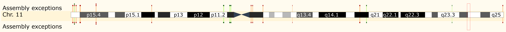
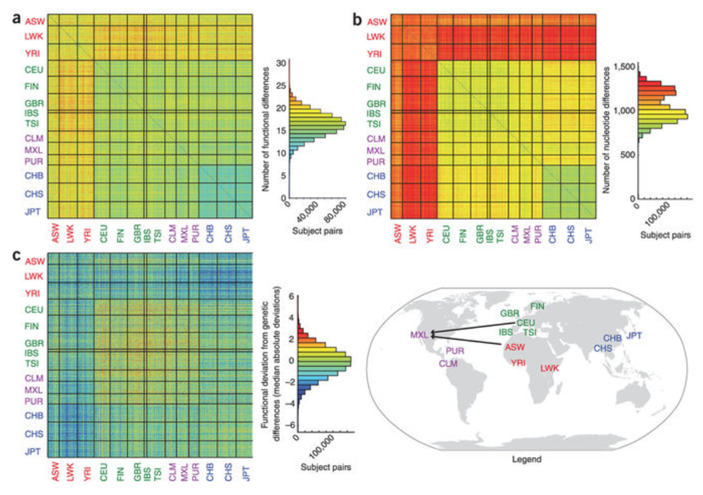
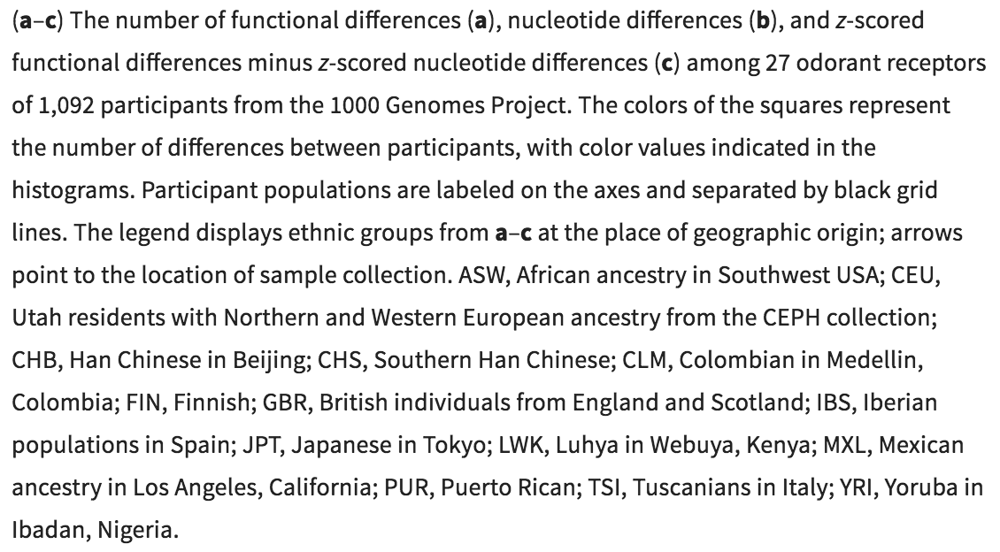
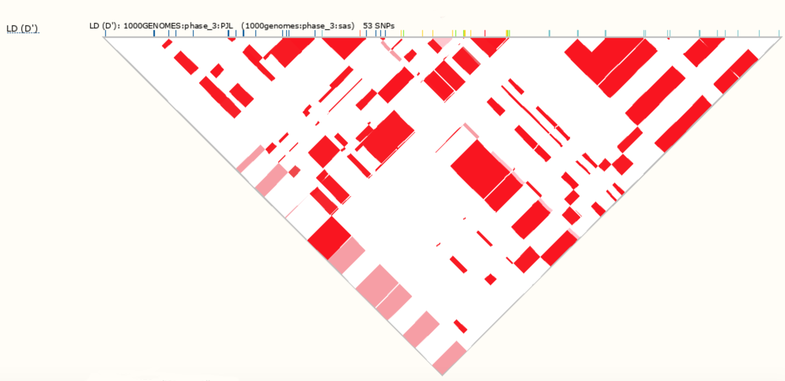

<center>



</center>

##Introduction 

This project is going to be a preliminary exploration of population genetics in R. I'm going to try and take genomic data from 1KG and replicate some of the analyses that I learned to do last year with Lisa in Perl. The gene that I will be using as my guinea pig is the gene OR10G4, which was found by Mainland et al.[^1] to have SNPs that are implicated in differences in olfactory phenotypes in humans. The goal of this study is to assess whether the SNPs in this gene shows signatures of selection acting on them. This would implicate that human olfaction is subject to environmental pressures, which is not something that has been properly looked at. So, let's see if we can't get some of this stuff to work.

##Background 

The largest gene family in humans is the OR gene family, which encodes our roughly 400 intact odor receptors (and around 800 receptors total). These odorant receptors have been shown to have high genetic variability among individuals, which affects odor perception[^1]. SNPs in many of these genes have been shown to affect the olfaction phenotypes of individuals, in some cases making odorants smell like completely different scents to different people. One large example of this is androstenone, which is an "odorous steroid derived from testosterone". On an individual level, the steroid's odor perception can vary from smelling "bad," to smelling "good," to being completely odorous[^2]. Finally, it has been shown by Mainland et al. that individuals from 1KG populations share functional differences across 27 various odor receptors (see figure below)[^1].
<center>




</center>

<br>The gene OR10G4 was the subject of testing by Mainland et al. for looking at participants' perception of three odorants: guaiacol, vanillin, and ethyl vanillin. In particular, four alleles were chosen with MAF>4% to judge whether they aided in the perception (particularly, the intensity of which they were smelled) of these odorants. It was found that 15% of the variation in guaiacol scent was caused by the genotypes in OR10G4, and none of the variation in intensity of vanillin or ethyl vanillin was explained by these alleles[^1]. Because guaiacol is a part of many natural flavors, I decided to look at OR10G4 in this study, because logically, it is possible for at least one of these genes (hopefully OR10G4) that contains odorant perception-altering SNPs to have different genotypes more prevalent in 

##Methodology/Results

Ok so I'm gonna start out by getting some data in to R. I've used the Ensembl Data Slicer [^3] to get a VCF file of all of the SNPs in the gene OR10G4 (located on chr11:123,886,282-123,887,217 in the cytogenetic band 11q24.2). I'm going to use the package vcfR for the initial read-in of the data. 

```{r}
library(vcfR)

OR10G4 <- read.vcfR("OR10G4.vcf.gz", verbose = TRUE)
```

I originally wanted to try creating a detailed DNAbin object here, like, with additional information besides the original vcfR object. I want to eventually learn how to attach a fasta file as a reference sequence to a DNAbin made from a vcfR object, but that will not happen with this project. Instead, you can *technically* make a DNAbin just from a vcfR object, so that's what I'm going to do for now. If there's errors in my analyses because my DNAbin lacks additional info, I apologize. So, here's my DNAbin object: 

```{r}
myDNA <- vcfR2DNAbin(OR10G4)
```

Ok, now that that is made, I'm going to do some experimental population genetic analyses using VCF file I have now, which contains all of the 1KG populations. Later, I will choose a couple to look at individually, but these analyses will be used as a) a place to test all of my analyses to make sure they work, and b) as something I can compare everything back to at the end. The tests I will be performing are: Hardy-Weinberg, Tajima's D (this is the analysis that uses the DNAbin object, so I hope this works...), Heterozygosity, and LD. 


```{r}
library(pegas)

#hardy-weinberg test
pegas.data <- vcfR2genind(OR10G4, sep = "[|/]")
hw.test(pegas.data, B = 0)


#Tajima's D test
tajima.test(myDNA)

#Heterozygosity
het1 <- summary(pegas.data)
het1

names(het1)

plot(het1$Hobs, xlab="Loci number", ylab="Observed Heterozygosity", 
     main="Observed heterozygosity per locus")

plot(het1$Hobs, het1$Hexp, xlab="Hobs", ylab="Hexp", 
     main="Expected heterozygosity as a function of observed heterozygosity per locus")

#LD (this one may get tricky)

library(pegas)

loci <- genind2loci(pegas.data)

``` 

I am splitting up this chunk to talk more about my LD analysis. So in order to check out LD in the way that I would like to by using the LDscan function, we need to know whether our data is "phased," which, I don't know what that means but it is apparently easier to work with phased data than unphased. Because there's apparently no easy way to "phase" the data from the file type I converted from, we may be shit out of luck on that front. That being said, I have an idea of how I want to do LD if our data is unphased.

```{r results='hide'}

is.phased(loci)

```

(I split that function up from the rest of the LD analysis so I could hide the results because they were very long) Welp, time to go with plan B, which is use the LD2 function. As I learned the hard way (lol), you specify the locus by which number SNP it is in the gene, and not by the SNP ID number. Since there are 73 SNPs in this gene, I'll just first look at whether there is LD between the first and last SNP. After that, I may just play around with other SNP numbers. 

```{r}
LD2(loci, locus = c(1, 73), details = TRUE)

#Well that's shit. Let's try some more. 

LD2(loci, locus = c(1, 30), details = TRUE)
LD2(loci, locus = c(10, 73), details = TRUE)
LD2(loci, locus = c(10, 30), details = TRUE)
```

So here is what I learned from doing this general look: 

- There are 5 SNPs with siginificant P-vals (rs79057843, rs11219407, rs4084209, rs61908597, rs4936882). This means that globally, these 5 SNPs are not in HWE. Let's see how that compares to individual populations. 

- There could have been global evidence of purifing selection, but the P-vals are not significant. Therefore, there is no selection happening on this gene globally. 

- There is heterozygosity at several loci. This may possibly indicate something. Not sure what.

- There is absolutely no linkage disequilibrium globally. I would have thought otherwise, because the location of this gene on chromosome 11 makes it incredibly likely that crossover is happening involving this gene. I will continue to look for LD, but am not expecting much. 


For the rest of this study, I'm going to focus on one population from each broader region (Europe, Africa, Americas, South Asia, East Asia). I can separate these populations out with the Data Slicer, so I'm going to read in some population data separately. The populations I'm going with are: JPT (Japanese in Tokyo, Japan), FIN (Finnish in Finland), LWK (Luhya in Webuye, Kenya), PUR (Puerto Ricans from Puerto Rico), and PJL (Punjabi from Lahore, Pakistan). When I have all of those population separated out I will begin testing each of them for signatures of selection.


```{r}
#importing data for just the populations specified above

JPT <- read.vcfR("JPT.vcf.gz", verbose = TRUE)
JPT

FIN <- read.vcfR("FIN.vcf.gz", verbose = TRUE)
FIN

LWK <- read.vcfR("LWK.vcf.gz", verbose = TRUE)
LWK

PUR <- read.vcfR("PUR.vcf.gz", verbose = TRUE)
PUR

PJL <- read.vcfR("PJL.vcf.gz", verbose = TRUE)
PJL
```

Now that we have our separate population data, we can repeat our analyses with it. I will start with the JPT data. 

```{r}
#JPT

library(pegas)

#hardy-weinberg test
pegas.JPT <- vcfR2genind(JPT, sep = "[|/]")
hw.test(pegas.JPT, B = 0)
#All of the alleles in this population are in HWE

#Tajima's D test

JPTdna <- vcfR2DNAbin(JPT)

tajima.test(JPTdna)

#D-value is 1.33, but P-value is not significant, so we cannot interpret this as selection. 

#Heterozygosity
het2 <- summary(pegas.JPT)
het2

names(het2)

plot(het2$Hobs, xlab="Loci number", ylab="Observed Heterozygosity", 
     main="Observed heterozygosity per locus")

plot(het2$Hobs, het2$Hexp, xlab="Hobs", ylab="Hexp", 
     main="Expected heterozygosity as a function of observed heterozygosity per locus")

#Not sure if that's significant or not...

#LD
library(pegas)

JPTloci <- genind2loci(pegas.JPT)

LD2(JPTloci, locus = c(1, 73), details = TRUE)

#Strange... I think this means there is absolutely 100 percent no LD...

LD2(JPTloci, locus = c(10, 73), details = TRUE)
LD2(JPTloci, locus = c(30, 73), details = TRUE)

#Yeah, there's no LD here. 
```

Now I will do FIN:

```{r}
#hardy-weinberg test
pegas.FIN <- vcfR2genind(FIN, sep = "[|/]")
hw.test(pegas.FIN, B = 0)
#No SNPs out of HWE here

#Tajima's D test

FINdna <- vcfR2DNAbin(FIN)
tajima.test(FINdna)

#D-val is greater than 0, but P-vals are not significant, so this is not interpreted as selection

#Heterozygosity
het3 <- summary(pegas.FIN)
het3

names(het3)

plot(het3$Hobs, xlab="Loci number", ylab="Observed Heterozygosity", 
     main="Observed heterozygosity per locus")

plot(het3$Hobs, het3$Hexp, xlab="Hobs", ylab="Hexp", 
     main="Expected heterozygosity as a function of observed heterozygosity per locus")

#I think I need to compare all of the graphs for this to work? 

#LD

FINloci <- genind2loci(pegas.FIN)

LD2(FINloci, locus = c(1, 73), details = TRUE)

#Same as above... no LD. Will check other loci just to be sure.

LD2(FINloci, locus = c(10, 73), details = TRUE)
LD2(FINloci, locus = c(30, 73), details = TRUE)

```

Now I will do LWK

```{r}
#hardy-weinberg test
pegas.LWK <- vcfR2genind(LWK, sep = "[|/]")
hw.test(pegas.LWK, B = 0)
#No SNPs out of HWE here

#Tajima's D test

LWKdna <- vcfR2DNAbin(LWK)
tajima.test(LWKdna)

#D-val is greater than 0, but P-vals are very not significant, so this is not interpreted as selection

#Heterozygosity
het4 <- summary(pegas.LWK)
het4

names(het4)

plot(het4$Hobs, xlab="Loci number", ylab="Observed Heterozygosity", 
     main="Observed heterozygosity per locus")

plot(het4$Hobs, het4$Hexp, xlab="Hobs", ylab="Hexp", 
     main="Expected heterozygosity as a function of observed heterozygosity per locus")

#This one appears to have less heterozygosity than the rest... is that significant?

#LD

LWKloci <- genind2loci(pegas.LWK)

LD2(LWKloci, locus = c(1, 73), details = TRUE)

#Same as above. Nothing.

LD2(LWKloci, locus = c(10, 73), details = TRUE)
LD2(LWKloci, locus = c(30, 73), details = TRUE)

```

Now I will do PUR

```{r}
#hardy-weinberg test
pegas.PUR <- vcfR2genind(PUR, sep = "[|/]")
hw.test(pegas.PUR, B = 0)
#rs4936881 is not in HWE, which, interestingly, is not one that is not in HWE globally. 

#Tajima's D test

PURdna <- vcfR2DNAbin(PUR)
tajima.test(PURdna)

#D-val is greater than 0, but P-vals are not significant, so this is not interpreted as selection

#Heterozygosity
het5 <- summary(pegas.PUR)
het5

names(het5)

plot(het5$Hobs, xlab="Loci number", ylab="Observed Heterozygosity", 
     main="Observed heterozygosity per locus")

plot(het5$Hobs, het5$Hexp, xlab="Hobs", ylab="Hexp", 
     main="Expected heterozygosity as a function of observed heterozygosity per locus")

#possibly less heterozygosity than normal?

#LD

PURloci <- genind2loci(pegas.PUR)

LD2(PURloci, locus = c(1, 73), details = TRUE)

#Yep. None.

LD2(PURloci, locus = c(10, 73), details = TRUE)
LD2(PURloci, locus = c(30, 73), details = TRUE)

```

Finally, I will do PJL. 

```{r}
#hardy-weinberg test
pegas.PJL <- vcfR2genind(PJL, sep = "[|/]")
hw.test(pegas.PJL, B = 0)
#technically all are in HWE, but there are a few SNPs that are close to not being in HWE.  

#Tajima's D test

PJLdna <- vcfR2DNAbin(PJL)
tajima.test(PJLdna)

#D-val is greater than 0, but P-vals are not significant, so this is not interpreted as selection

#Heterozygosity
het6 <- summary(pegas.PJL)
het6

names(het6)

plot(het6$Hobs, xlab="Loci number", ylab="Observed Heterozygosity", 
     main="Observed heterozygosity per locus")

plot(het6$Hobs, het6$Hexp, xlab="Hobs", ylab="Hexp", 
     main="Expected heterozygosity as a function of observed heterozygosity per locus")

#So it does seem that there are differences in heterozygosity in each of these populations, but what does that mean?

#LD

PJLloci <- genind2loci(pegas.PJL)

LD2(PJLloci, locus = c(1, 73), details = TRUE)

#:)

LD2(PJLloci, locus = c(10, 73), details = TRUE)
LD2(PJLloci, locus = c(30, 73), details = TRUE)


```

Before I move on to the discussion, I want to make a graphic with all of the heterozygosity plots together, just because it will make heterozygosity easier to discuss. 

```{r}
par(mfrow=c(3,2))
plot(het1$Hobs, xlab="Loci number", ylab="Observed Heterozygosity", main="Heterozygosity in All Populations")
plot(het2$Hobs, xlab="Loci number", ylab="Observed Heterozygosity", main="Heterozygosity in JPT")
plot(het3$Hobs, xlab="Loci number", ylab="Observed Heterozygosity", main="Heterozygosity in FIN")
plot(het4$Hobs, xlab="Loci number", ylab="Observed Heterozygosity", main="Heterozygosity in LWK")
plot(het5$Hobs, xlab="Loci number", ylab="Observed Heterozygosity", main="Heterozygosity in PUR")
plot(het6$Hobs, xlab="Loci number", ylab="Observed Heterozygosity", main="Heterozygosity in PJL")
```

##Discussion
This is a bulleted summary of my conclusions about this data: 

* Globally, there are 5 SNPS (insert SNP IDs here) that are not in HWE. However, in looking at the 5 populations, only PUR has a SNP that is not in HWE, and it is not the same as any of the SNPs that are globally not in HWE. Therefore, more populations will need to be studied in order to determine which populations are influencing the SNPs that are in global HWE disequilibrium. 
* Globally, the Tajima's D is not significant. But, population FIN was close to having a significant P-value for positive selection. Therefore, it would be of interest to look at the Tajima's D of other European (or even global) populations to see if there is a population that is experiencing positive selection. 
* On the topic of Tajima's D: Glabally, the Tajima's D score was negative. Although the P-val wasn't statistically significant, this is the only time we have seen a negative Tajima's D. Maybe there is a population that is under extreme purifying selection? Again, something to look for. 
* There has been shown to be no LD between any of the SNPs in this gene, both globally and on the population level. This has surpised me, considering the location of the gene on Chromosome 11. This means that there are no two SNPs that create a phenotype important enough to warrant their joint crossing over. This was probably to be expected, since humans do not rely on olfactory cues very much.
  + HOWEVER, after examining the LD on Ensembl's gene browser, I      have seen that there is, in fact, some populations that have      very high rates of LD, so I will focus on looking for that in     my data more this summer. I included a screenshot below of the     PJL LD block to show that there is in fact LD. 
* Finally, on the note of heterozygosity, it is clear from my that there is differing levels of heterozygosity across the populations I looked at, and it appears that all of the same SNPs in each population were displaying heterozygosity. Whether this is a clue to whether heterozygosity is happening due to a heterozygous phenotype being favored for those SNPs, or because either phenotype doesn't produce all that much of a difference, and it doesn't matter much if someone is homozygous or heterozygous, I do not know. I would guess that it is the second one though. 
<center>

</center>

<br> To conclude, I would like to say that this was an interesting preliminary study. I suspected there would not be much in the way of selection signatures in OR10G4, since humans do not rely heavily on smell. It would have certainly been interesting if there was some selection, based on different odorants in the environment that people need to hone in on, but as of right now that looks like it is not the case. It is promising, however, that there seems to be SNPs globally that are not in HWE (and are being acted on by selection), as well as some almost-significant Tajima's D statistics. Additionally, it's worth noting that there may have been some R error on my part, since this was my first time doing any sort of SNP analysis in R. Hopefully, if there were errors (for example, the lack of a reference sequence in my DNAbin object may have screwed things up), I can iron them out over the summer. Nevertheless I think this was a good preliminary experiment in genomics in R. I expect to explore more populations, and possibly more genes (actually, I am interested in looking at the gene OR7D4, which is known to cause differences in odor perception of androstenone) that have SNPs that influence odor perception in the near future. 

##References

[^1]: Mainland, Joel et al. "The Missense of Smell: Functional Variability in the Human Odorant Receptor Repertoire." Nature Neuroscience 17 (December 8, 2013): 114-20. Accessed May 6, 2018. 
doi:10.1038/nn.3598. 
[^2]: Keller, Andreas et al. "Genetic Variation in a Human Odorant Receptor Alters Odour Perception." Nature 449 (September 16, 2007): 468-72. Accessed May 6, 2018. doi:10.1038/nature06162. 
[^3]:EMBL-EBI. "Data Slicer." Ensembl. Last modified March 2014. Accessed May 6, 2018. http://grch37.ensembl.org/Homo_sapiens/Tools/DataSlicer. 
